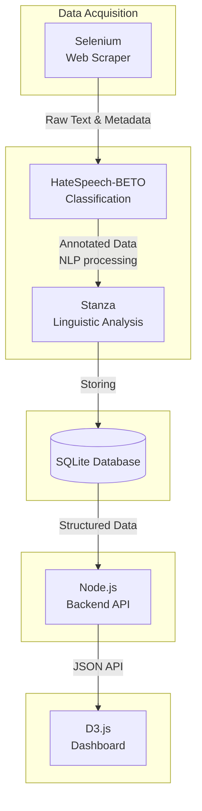
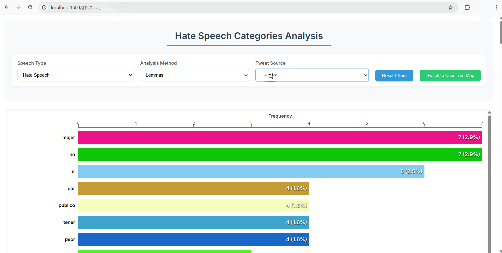
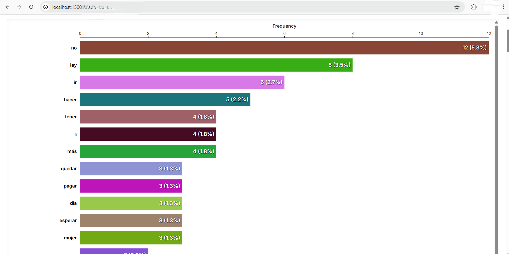
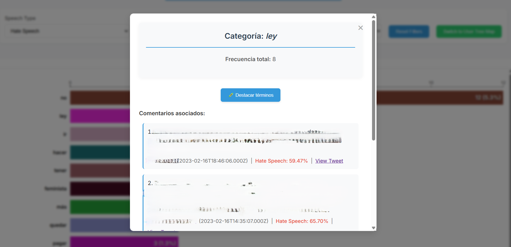
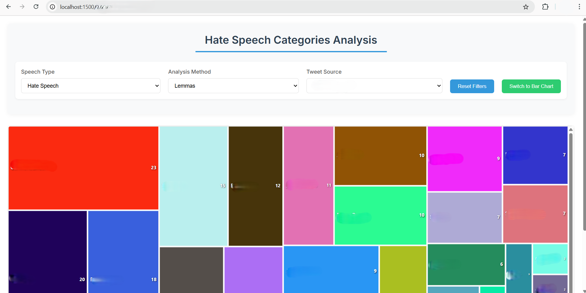
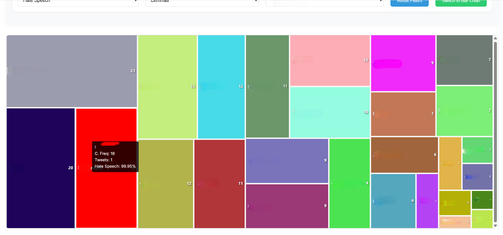
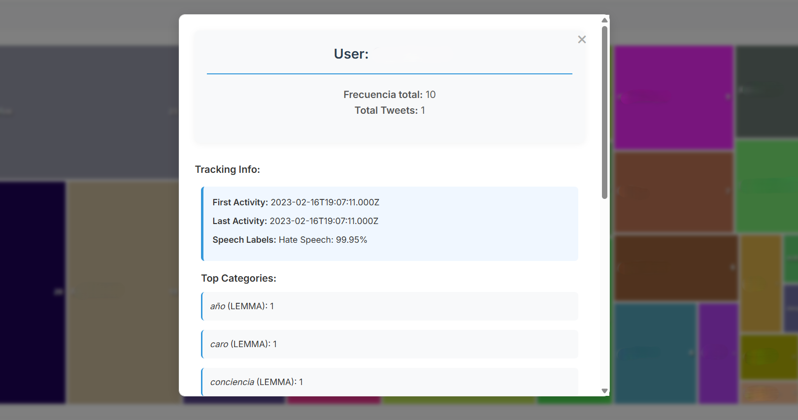
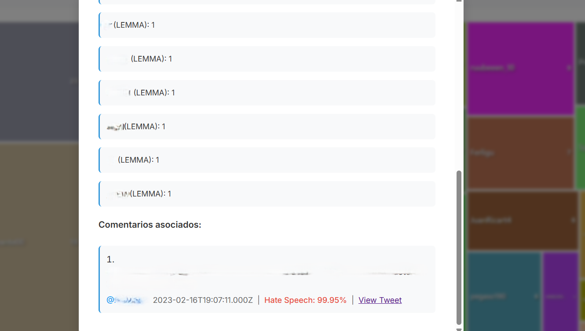

# 🛡️ Content-Moderator_Full-Stack-Tool  
**Automated Hate Speech Moderation in Spanish digital platforms.**  

---

## 📖 Overview  
This project is the outcome of my Master’s Thesis at Universidad Complutense de Madrid (2025).  
It combines **Natural Language Processing (NLP)**, **Transformers**, and **Full-Stack Development** to build a system for **automatic detection, classification, and critical visualization of hate speech in Spanish social media**.  

The aim is to support **researchers, institutions, and civil society** in monitoring harmful discourse online, while addressing the ethical and epistemological challenges of AI.  

---

## 🔒 Confidentiality & Access  
Due to the sensitive nature of the project (offensive language, vulnerable communities, user-level tracking data, and reportable content), only part of the code is public:  

- ✅ **Available**: the fine-tuned **BETO model** (Hugging Face) and selected fragments of the pipeline.  
- 🔐 **Restricted**: the full-stack architecture (Selenium data miner, NLP pipeline with Stanza + SQLite, Node.js backend, D3.js dashboard).  

➡️ Please contact me directly if you need access to the complete code, thesis, or a live demo.  

---

## ⚙️ Technical Full-Stack Architecture
- **Model**: BETO (Spanish BERT) fine-tuned for hate speech detection and text classification 
- **Libraries**: Hugging Face Transformers, PyTorch, Stanza, Scikit-learn  
- **Pipeline**:  
  - Data mining with Selenium  
  - Classification pipeline (Python, Transformers, Stanza)  
  - Storage with SQLite
- **Web Development**
  - Backend: Node.js (JavaScript) y SQLite
  - Frontend: D3.js interactive visualizations and Vanilla (JavaScript), CSS, HTML

---

## 📊 Model Training Details  
- 🤗 [Model on Hugging Face](https://huggingface.co/delarosajav95/HateSpeech-BETO-cased-v2)
- [GitHub](https://github.com/delarosajav/HateSpeech-BETO-cased-v2)

---

## 🧪 Model Performance  
- **Global Accuracy**: 84.66%  
- **Weighted F1-score**: 0.843  

| Category       | Precision | Recall | F1-score |
|----------------|-----------|--------|----------|
| Non-offensive  | 0.88      | 0.91   | 0.899    |
| Hate speech    | 0.73      | 0.64   | 0.684    |

---

## 🚀 Use Case: Content Moderation  

This tool was designed to demonstrate how **AI and full-stack development** can support content moderation and digital research in Spanish-speaking contexts.  

- **Input**: Social media threads (e.g., Twitter/X) scraped via Selenium  
- **Processing**: Automatic hate speech classification (BETO Transformer) enriched with linguistic features (lemmatization, NER via Stanza)  
- **Output & Visualization (Dashboard)**:  
  - Animated bar charts  
  - User treemaps  
  - Interactive filters by user, date, or linguistic features
  - Tracking info 

---

## 📊 Case Study: Political Discourse in Spain  

As part of the project, the system was deployed to analyze public discourse around a major political debate:  

- **886 comments** were extracted and classified  
- **14.9%** were identified as hate speech  
- The **dashboard** enabled filtering and exploration of the conversation dynamics for critical analysis  

### 📷 **Screenshots of the interactive D3.js dashboard:** 

*Figure 1. Interactive Bar Chart – Category distribution with percentage values.*

*Figure 1.2. Interactive Bar Chart – Category distribution with percentage values.*

*Figure 2. Bar Details Modal – Frequency, comments, user tracking, and action buttons.*

*Figure 3. Interactive Tree Map – Hierarchical category overview with area proportional to frequency.*

*Figure 3.2. Interactive Tree Map – Hierarchical category overview with area proportional to frequency.*

*Figure 4. Tree Map Details Modal – User info, category breakdown, frequency, comments, and speech labels.*

*Figure 4.2. Tree Map Details Modal – User info, category breakdown, frequency, comments, and speech labels.*

---

## 🌍 Contributions  
- Fine-tuned **BETO model** for Spanish hate speech detection.  
- **Full-stack pipeline**: from raw data extraction to interactive visualization.  
- Integration of **linguistic analysis** (Stanza) with deep learning classification.  
- Open-source orientation: reproducible, transparent, ethically grounded.  

---

## 🔮 Future Work  
- Extend to **multilingual & multimodal** datasets (text + images + video).  
- Irony/sarcasm detection.  
- Lightweight deployment for **low-resource environments**.  
- API + browser plugin for NGOs and institutions.  
- Ethical auditing protocols (bias, false positives).  

---

## 📂 Resources  
- 🤗 [Model on Hugging Face](https://huggingface.co/delarosajav95/HateSpeech-BETO-cased-v2)  
- 📄 Full-stack code & thesis → available upon request  

---

## 👤 Author  
**Javier de la Rosa Sánchez**  
- [LinkedIn](https://www.linkedin.com/in/delarosajav95/)  
- [GitHub](https://github.com/delarosajav)  

---

